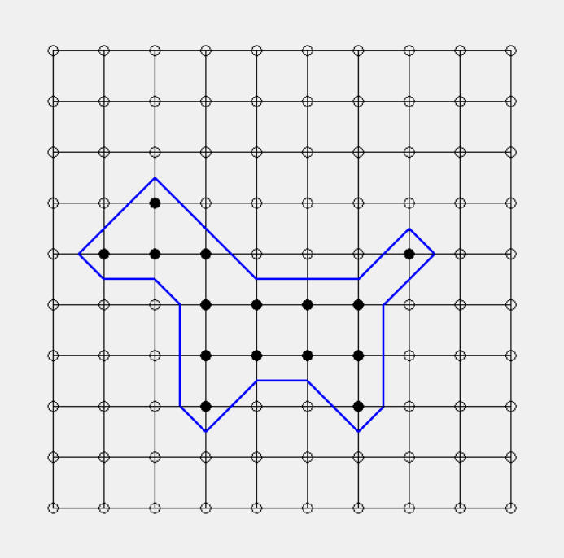

# Overview
This is a program that generates a 2D mesh using the marching squares algorithm.

# Requirements
- Python 3.8

# Demos

  
  <figcaption>
    

    <b>Figure 1. 9x9 grid with each cell of size equal to 50x50 pixels.</b> Each intersection point in the grid can be clicked to change the bit value (black = 1, white = 0). The blue line generated inside each cell depends on the bit values of its corners.
    

  </figcaption>

# References
1. https://en.wikipedia.org/wiki/Marching_squares
2. https://www.huderlem.com/demos/marchingsquares.html
